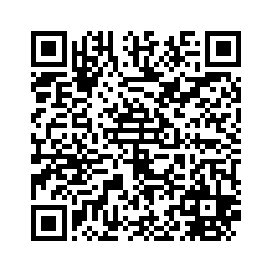

# Skywave

Internet radio for the Nintendo 3DS.

Skywave streams live MP3 radio stations straight to the console — Classic FM,
BBC stations, and roughly fifty thousand others — over Wi-Fi, with a two-screen
interface built for a d-pad and a thumb rather than a mouse.


---

## What it does

* **Browse** the most-listened stations worldwide, pulled live from the
  [radio-browser.info](https://www.radio-browser.info/) directory. No account,
  no key, no station list to maintain by hand.
* **Search** by name with the system keyboard.
* **Save** stations to a favourites list that survives a reboot.
* **Now playing** — Skywave reads the SHOUTcast/Icecast ICY metadata stream, so
  the top screen shows the actual track title as it changes, not just the
  station name.
* **Update itself** from GitHub. The About tab checks for a newer release,
  downloads the CIA, installs it, and relaunches.

## What it needs

| | |
|---|---|
| Console | Any 3DS / 2DS family console with custom firmware |
| Network | Wi-Fi, connected |
| DSP firmware | `sdmc:/3ds/dspfirm.cdc` — **required for sound** |
| Free space | ~1 MB |

### The DSP firmware, and why it is not optional

The 3DS decodes and mixes audio on a dedicated DSP core, and the DSP's firmware
is copyrighted Nintendo code that cannot be redistributed. Every homebrew
application that makes sound needs you to dump it once from your own console
using [DSP1](https://github.com/zoogie/DSP1/releases). It takes about ten
seconds and only has to be done once, ever — after that every homebrew app on
the console has sound, not just this one.

Skywave still runs without it. Browsing, search and favourites all work; only
playback is unavailable, and the moment you press play it names the missing
file. This is a hard platform limit, not a missing feature: there is no legal
way around it.

### The certificate bundle, and why streams don't use it

Skywave ships a RomFS containing one file, `romfs/cacert.pem` — the Mozilla CA
bundle (121 certificates, 188 KB). A newer bundle can be dropped at
`sdmc:/config/ssl/cacert.pem` without waiting for a Skywave release — that is
the Luma3DS/curl/Homebrew-Launcher convention, and it is preferred over the
bundled copy whenever it exists.

Verification is deliberately asymmetric. Radio **streams** do not check the
certificate and fall back to plain http if TLS cannot be completed — nothing
secret is sent to a station, and the payload is public audio. The in-app
**updater** always verifies and never falls back, because what it downloads is
an executable the console will install.

## Installing

**QR code (no SD card, no computer):**



Open FBI on the console, choose **Remote Install → Scan QR Code**, and point the
camera at that. FBI downloads and installs the CIA over WiFi on its own. The code
encodes the direct asset URL for **v1.0.3**:

```
https://github.com/stevenjc2009-byte/skywave/releases/download/v1.0.3/skywave1.0.3.cia
```

This is also how you update: scan the code for the new version and FBI installs
over the old one, keeping your favourites. See the note on the in-app updater
below for why that is the recommended route today.

Regenerate it after a version bump with `python tools/make_qr.py --verify` — it
reads the version out of `source/version.h` and decodes the image it just wrote
to prove the code really scans to that URL.

**CIA (installs as a real title with a banner):**

1. Download `skywave<version>.cia` from
   [Releases](https://github.com/stevenjc2009-byte/skywave/releases/latest).
2. Copy it to your SD card.
3. Install it with FBI.

**3DSX (Homebrew Launcher):**

1. Download `skywave.3dsx`.
2. Copy it to `sdmc:/3ds/skywave/skywave.3dsx`.
3. Launch it from the Homebrew Launcher.

The self-updater installs CIAs, so it only works on the CIA build. Under the
Homebrew Launcher it will tell you a new version exists and leave the install
to you.

**The in-app updater has not been verified on real hardware.** Until this
session it went through libctru's `httpc`, which sits on the console's `ssl:C`
system module — fixed at TLS 1.1 with RSA key exchange and CBC ciphers, with no
libctru option able to raise it ([3dbrew: "the highest supported TLS protocol
version is v1.1"](https://www.3dbrew.org/wiki/SSL_Services)). GitHub answers a
TLS 1.1 handshake with `tlsv1 alert protocol version` — measured 2026-09-05
against `github.com`, `api.github.com`, `objects.githubusercontent.com` and
`release-assets.githubusercontent.com`, all four refused. Most https radio
stations failed the same handshake for the same reason, though there is no
fixed count to quote for that: the station list is pulled live from
radio-browser.info rather than shipped in the app, so whatever passed or
failed on a given day was never a stable number. That is why the in-app
updater could never work through the system module.

Skywave now opens its own sockets and performs its own TLS with mbedtls 2.28.8
from devkitPro's portlibs, negotiating TLS 1.2 with ECDHE, and reaches GitHub
and the https stations that `ssl:C` refused. `ssl:C` is still initialised at
startup, but only as a random-number source for mbedtls — never for a
handshake. This has not been compiled or run on a console yet, so treat the
updater as unverified until that changes: use the QR code above to update in
the meantime. FBI can install from the same URL either way, because FBI does
not use the system module.

## Controls

| Input | Does |
|---|---|
| Touch screen | Pick a tab, pick a station, drag to scroll |
| D-pad / C-stick | Move the selection |
| A | Play the selected station |
| Y | Save / unsave the selected station |
| X | Stop playback |
| L / R | Volume down / up |
| ZL / ZR | Previous / next tab |
| START | Quit |

## How it works

```
  net thread  ──►  ring buffer  ──►  decoder thread  ──►  DSP
  (core 1)         (128 KB)          (core 0)
  socket + TLS     lock-free         mpg123            ndsp
  ICY demux        SPSC              feed API          4 × 32 KB wavebufs
```

The network thread runs on the second CPU core, unlocked with
`APT_SetAppCpuTimeLimit(30)`, so a slow station cannot stall the decoder or the
interface. It strips the ICY metadata blocks out of the byte stream (the title
updates are interleaved into the audio at a fixed interval) and writes pure MP3
into a lock-free ring. The decoder thread feeds that ring into mpg123 and hands
PCM to `ndsp`. Nothing is dropped: if the ring fills, the network thread waits.

Playback does not start until the ring holds about three seconds of audio,
sized from the station's own advertised bitrate. That prebuffer is the whole
difference between "internet radio on a 3DS" and "a stutter every four
seconds".

The updater follows the `releases/latest` **302 redirect** rather than calling
the GitHub API, because the API allows 60 requests an hour *per IP address* —
shared across everyone behind the same address — and a rate-limited updater
looks exactly like a broken one.

### Layout

```
source/app/        the run loop, background jobs, tab behaviour
source/audio/      ndsp + mpg123 player, lock-free ring buffer
source/net/        sockets + mbedtls TLS, HTTP, ICY demuxer, directory client + parser
source/store/      favourites file
source/ui/         citro2d drawing and input
source/update/     GitHub self-update
deps/jsmn.h        vendored JSON parser (MIT)
tests/             host-side tests for the parsers and the ring
tools/             build, release, art generation, test runner
cia/               RSF spec, banner art and audio
```

## Building

Needs devkitPro with `3ds-dev`, the `3ds-mpg123` portlib, and the `3ds-mbedtls`
portlib (the app's own TLS, replacing the console's `ssl:C` for handshakes):

```bash
pacman -S 3ds-dev 3ds-mpg123 3ds-mbedtls
```

From the **devkitPro MSYS2 shell**:

```bash
bash tools/build.sh      # skywave.3dsx
bash tools/build.sh cia  # skywave.3dsx + skywave.cia
```

Cutting a release (names the asset the way the updater expects to find it):

```bash
bash tools/release.sh
```

### Tests

The parsers and the ring buffer are plain C with no 3DS dependencies, so they
are tested on the host. From a Linux/WSL shell:

```bash
bash tools/wsl_run_tests.sh
```

That fetches a real directory response and a real stream capture, then runs all
three suites against them. The ICY suite checks that stripping the metadata out
of a genuine 400 KB capture leaves an unbroken MPEG frame chain, and checks that
*not* stripping it breaks that chain — so the test can actually fail.

## Art and audio

The icon, banner and boot chime are generated procedurally by
`tools/make_art.py`. No third-party artwork, fonts or audio ship with Skywave,
and no station's branding is reproduced anywhere in it.

## Credits

* Station directory: [radio-browser.info](https://www.radio-browser.info/) —
  a community-run, free, no-key API.
* [libctru / citro2d](https://github.com/devkitPro) — devkitPro.
* [mpg123](https://www.mpg123.de/) — MP3 decoding (LGPL 2.1).
* [jsmn](https://github.com/zserge/jsmn) — JSON parsing (MIT).

Skywave is not affiliated with, endorsed by, or connected to Nintendo, or to
any broadcaster whose stations appear in the directory. Stations are listed and
streamed exactly as the directory publishes them.

## Licence

MIT — see [LICENSE](LICENSE).
